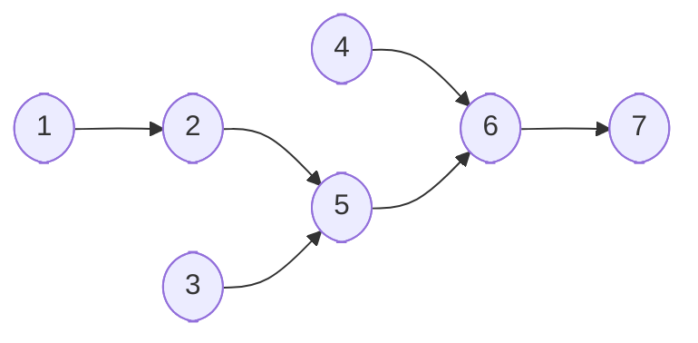

# relax-graph

Simple graph builder.

- The Graph is copy and refined from Dolphin Scheduler, 
- And render mermaid flowchart diagram as string, copy and view the diagram with [https://mermaid.live](https://mermaid.live).

## Release

- Snapshot: `mvn clean deploy`
- Release: `mvn clean package source:jar gpg:sign install:install deploy:deploy`
